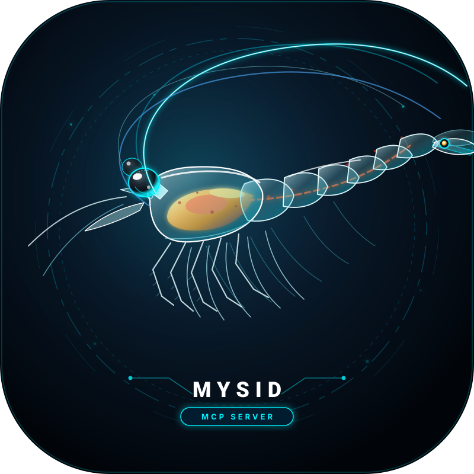

<p align="center">
  
</p>

<p align="center">
  
  
  
  
</p>

# mysid — High-Performance Native Codebase Intelligence & MCP Server

`mysid` is an ultra-fast, standalone code intelligence engine and Model Context Protocol (MCP) server written in Rust. It eliminates bloated token footprints and multi-turn round-trips for AI coding agents and human developers alike.

---

## Core Capabilities & Architectural Pillars

### 1. Official Model Context Protocol (MCP) Implementation
- **Standard Protocol Compliance**: Fully adheres to the official MCP specification (`2024-11-05`).
- **Native Stdio JSON-RPC**: Operates directly over standard I/O with sub-20ms latency — no Python, Node.js, or bridge runtimes required.
- **Dynamic Tool Schema Discovery (`tools/list`)**: Automatically publishes typed JSON Schemas for all tools, enabling IDEs to display typed parameters and descriptions.
- **Universal IDE Compatibility**: Instant plug-and-play with **Google Antigravity / Gemini**, **Claude Desktop**, **Cursor**, and **Cline**.

### 2. Architectural Source Graph: Callers & Callees Tracing
- **AST-Powered Impact Analysis**: Understand how a function or class ripples through the codebase before editing it.
- **Call-Flow Graph (`mysid graph --mode flow`)**: Maps upstream callers and downstream callees for any entry-point symbol.
- **Architectural Overview (`mysid graph --mode overview`)**: Summarizes cross-module dependencies, entry points, and high-degree architectural hubs.
- **Token Efficiency**: Gives AI agents complete structural context without reading thousands of unnecessary file lines.

### 3. Multi-Stack Adapter Architecture
`mysid` dynamically tailors its AST indexing, error filtering, and build heuristics according to the active technology stack:
- **Kotlin & Java**: Gradle Kotlin DSL (`build.gradle.kts`), Android manifests, Coroutines, Room, and Hilt.
- **Android & Native C/C++**: NDK, CMake, JNI header bindings, C++ folder patterns, and shared libraries.
- **Spring Boot**: REST controllers, services, repositories, JPA entities, and Maven/Gradle dependencies.
- **React & TypeScript / Next.js**: Component trees, JSX/TSX syntax, custom hooks, and npm dependencies.
- **Rust Crates**: Cargo workspaces, multi-crate module graphs, and type definitions.

### 4. Bare Filename Resolution & 150-Entry LRU Cache
- **Eliminates Path Hallucination**: AI agents frequently waste tokens guessing complex paths like `app/src/main/java/com/example/folderA/folderB/FileName.kt`.
- **Just the Filename**: Agents and developers simply pass the bare filename:
  ```powershell
  mysid read "FileName.kt#L10-40" "AnotherFile.cpp#L100-140"
  ```
- **150-Entry LRU Cache**: Automatically resolves bare filenames against the workspace directory tree in sub-millisecond time and caches them for lightning-fast repeat access.
- **Zero Single-Turn Peeking**: Bundle multiple arbitrary file slices into a single command to eliminate UI freezes.

### 5. Native Android ADB Toolkit & Build Diagnostics
- **Wireless ADB Pairing**: Auto-connect to devices over Wi-Fi (`mysid android connect_wifi`) without fiddling with USB cables.
- **Device & Logcat Stream Management**: List devices, stream filtered logs, and clear buffers with zero context switching.
- **Crash Log Extractor (`mysid android crashes`)**: Automatically parses logcat to extract clean, deduplicated Java/Kotlin/Native stack traces.
- **Device Automation**: Directly inject `tap`, `type`, and `keyevent` actions into connected hardware or emulators.
- **Token-Filtered Gradle Builds**: Filters compilation noise, extracting only the actionable errors to drastically reduce LLM prompt consumption.

### 6. High-Performance File Engine & Surgical Patching
- **Recursive Directory Creation (`mysid mkdir <path>`)**: Automatically creates all missing parent directories in a single atomic step.
- **Surgical Patching (`mysid patch <file> <old> <new>`)**: Fast, exact substring search-and-replace without line-number drift.
- **Atomic Multi-File Patching (`mysid patch_batch`)**: Apply multi-file edits simultaneously with rollback if any patch fails.
- **Global Workspace Refactoring (`mysid replace <old> <new>`)**: Workspace-wide search-and-replace with `--dry-run` diff preview mode.

---

## Directory Structure

```
mysid-mcp/
├── rust-mcp/              # Native Rust source code (Cargo workspace)
│   ├── src/
│   │   ├── main.rs        # CLI dispatcher & MCP JSON-RPC stdio loop
│   │   ├── ast.rs         # Tree-sitter AST symbol indexer & caller graph
│   │   └── tools/         # Core tools (read, search, replace, patch, android, build)
│   └── Cargo.toml
├── skills/                # Agent prompt & workflow skill specifications
│   ├── android-native.md  # Ultra-lean reference for Android & Native C++
│   └── MCP_COMMANDS.md    # Complete syntax manual
├── .github/workflows/    # Automated CI/CD release pipeline
├── mysid-mcp.svg          # Official vector logo
├── install.ps1            # One-click Windows global installer
├── package-portable.ps1   # Portable bundle & ZIP packager
├── Dockerfile             # Multi-stage container build (Glama & Docker MCP)
├── LICENSE                # Apache 2.0 License
└── .gitignore             # Excludes compilation artifacts and targets
```

---

## Quick Installation

### Windows (One-Click)

Open PowerShell and run:
```powershell
.\install.ps1
```
This automatically:
1. Compiles the release binary (or uses a precompiled `mysid.exe`).
2. Installs it to `%LOCALAPPDATA%\mysid\bin\mysid.exe`.
3. Adds it to your Windows User `PATH` (available in all new terminal sessions).
4. Auto-configures Antigravity/Gemini `mcp_config.json`.

---

## MCP Server Configuration

### Google Antigravity / Gemini (`~/.gemini/config/mcp_config.json`)
```json
{
  "mcpServers": {
    "mysid": {
      "command": "mysid",
      "args": []
    }
  }
}
```

### Claude Desktop (`%APPDATA%\Claude\claude_desktop_config.json`)
```json
{
  "mcpServers": {
    "mysid": {
      "command": "mysid",
      "args": []
    }
  }
}
```

---

## CLI Usage Reference

### 1. Set Workspace
```powershell
mysid set_workspace "C:\path\to\your\project"
mysid get_workspace
```

### 2. AST Lookup & Batch Code Slices
```powershell
# AST symbol definition + top callers
mysid read SymbolName

# Single-turn multi-slice reading (bare filenames are automatically resolved)
mysid read "FileName1.cpp#L100-150" "FileName2.kt#L20-60"
```

### 3. Fast Code Search
```powershell
# Multi-threaded regex/string search respecting .gitignore
mysid search "symbol_name" --types kt,cpp
```

### 4. Global Search & Replace
```powershell
# Refactor across the entire workspace
mysid replace "oldMethodName" "newMethodName" --types kt,cpp

# Preview changes before applying
mysid replace "oldMethodName" "newMethodName" --dry-run
```

### 5. Surgical File Patching
```powershell
mysid patch app/build.gradle.kts "versionCode = 44" "versionCode = 45"
```

### 6. Android Build & ADB Tools
```powershell
mysid build                # assembleDebug with token-filtered errors
mysid build clean          # clean assembleDebug
mysid release              # compile release bundle + verify R8 mapping
mysid install              # deploy APK to connected device

mysid devices              # list ADB devices
mysid android logcat --lines 50
mysid android crashes
```

---

## Building from Source

Requirements: [Rust](https://rustup.rs/) (stable toolchain).

```powershell
cd rust-mcp
cargo build --release
```
The compiled binary will be at `rust-mcp/target/release/mysid.exe`.

---

## Why Mysid?

A **mysid** is a small shrimp-like crustacean, commonly called a mysid shrimp. The name comes from the taxonomic group **Mysida**.

The name reflects several ideas behind this project:

1. **Adaptable** — Mysids inhabit a variety of environments, including caves, deep water, marine environments, and freshwater. Similarly, **Mysid MCP** is designed to operate across different development environments and interact with files, source code, build systems, and Android devices.

2. **Small but complex** — Despite their small size, mysids have sophisticated sensory and swimming systems. They move through complex environments, explore their surroundings, and locate resources. This reflects the role of Mysid MCP in navigating complex codebases, searching for relevant code, tracing project structure, and providing the right context to an AI agent.

3. **Explore and interact** — Mysids use their sensory systems to detect and respond to their surroundings while moving through the aquatic environment and obtaining available food. Similarly, Mysid MCP gives an AI agent tools to explore a development environment, locate relevant resources, and act on them.

